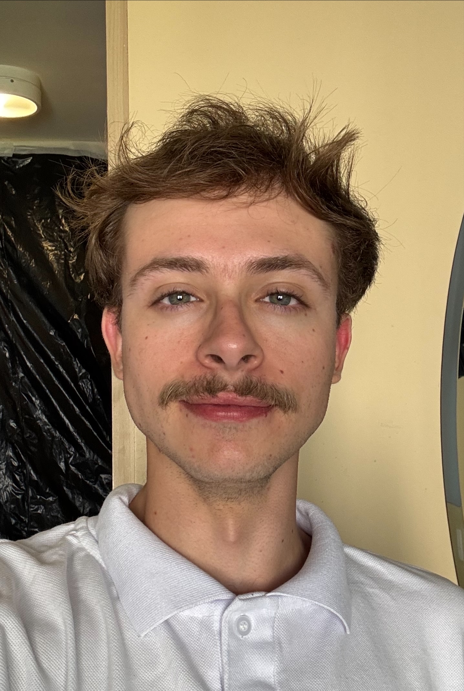
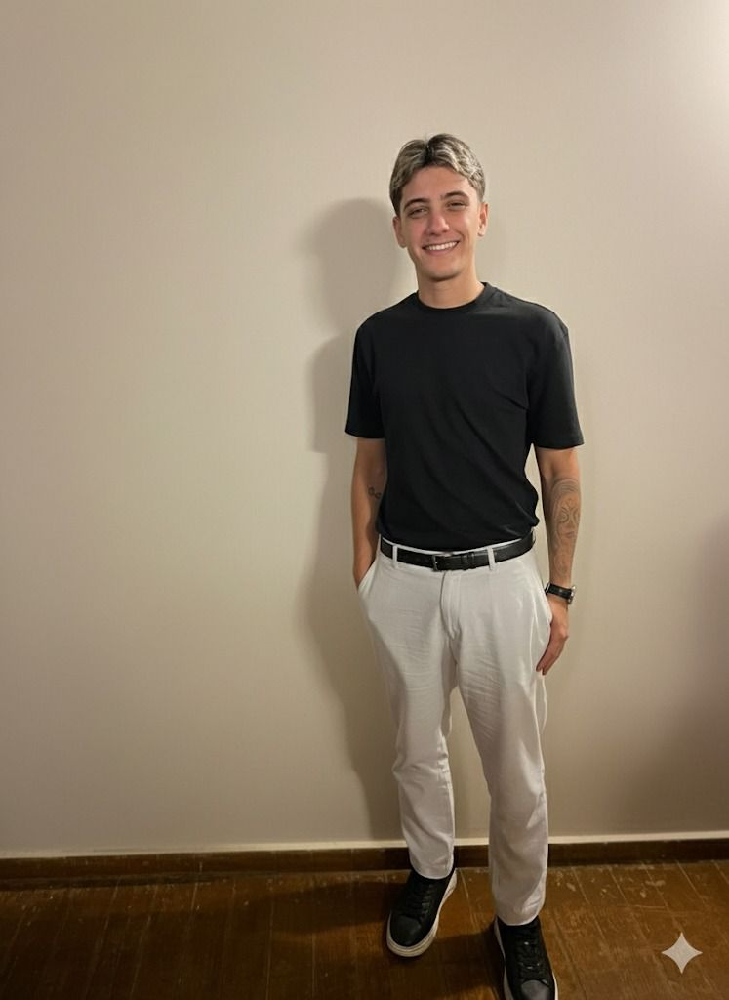

# NORA – Network of Resources Aid


> Projeto acadêmico desenvolvido na FIAP em parceria com a ONG Turma do Bem, com o objetivo de modernizar e centralizar os processos da ONG por meio de uma plataforma digital moderna.

---

## 📋 Descrição do Projeto

O **NORA (Network of Resources Aid)** é um sistema digital que centraliza informações, conecta pacientes e dentistas voluntários e fortalece o impacto da ONG Turma do Bem. A plataforma foi desenvolvida como uma SPA (Single Page Application) utilizando React, permitindo navegação fluida e experiência moderna ao usuário.

---

## 🚀 Tecnologias Utilizadas

| Tecnologia | Descrição |
|---|---|
|  | Biblioteca para construção de interfaces |
|  | Build tool e servidor de desenvolvimento |
|  | Tipagem estática para JavaScript |
|  | Framework de estilização utilitária |
|  | Navegação entre páginas (SPA) |
|  | Gerenciamento e validação de formulários |

---

## 📁 Estrutura de Pastas
```
src/
├── assets/                          # Imagens, ícones e mídias
├── components/
│   ├── BackButton/                  # Botão de voltar reutilizável
│   ├── FAQItem/                     # Item do accordion de FAQ
│   ├── Footer/                      # Rodapé da aplicação
│   ├── Layouts/
│   │   └── MainLayout/              # Layout principal com Navbar e Footer
│   ├── Navbar/                      # Barra de navegação responsiva
│   ├── Plataforma/
│   │   ├── PlataformaLayout/        # Layout da plataforma interna
│   │   ├── Sidebar/                 # Menu lateral responsivo com NavLinks
│   │   └── TopBar/                  # Barra superior com hambúrguer (mobile)
│   ├── TeamCard/                    # Card de integrante da equipe
│   └── index.ts                     # Exportações centralizadas
├── data/
│   ├── dashboardData.ts             # KPIs, casos recentes e atividade da IA
│   ├── dentistasData.ts             # Dentistas voluntários e especialidades
│   ├── encaminhamentosData.ts       # Encaminhamentos e histórico de follow-ups
│   ├── metricasData.ts              # Indicadores e dados para gráficos
│   ├── omnichannelData.ts           # Conversas, mensagens e dados do chat
│   └── pacientesData.ts             # Pacientes, triagens e análise da IA
├── pages/
│   ├── Colaboradores/               # Página do time + detalhe individual
│   ├── Contato/                     # Página de contato com formulário
│   ├── FAQ/                         # Dúvidas frequentes
│   ├── Home/                        # Página inicial
│   ├── Login/                       # Tela de autenticação JWT
│   ├── MelhorDentista/              # Programa Melhor Dentista do Mundo
│   ├── Megatriagens/                # Programa Megatriagens
│   ├── Plataforma/
│   │   ├── Dashboard/               # Painel principal com KPIs e atividade da IA
│   │   ├── Dentistas/
│   │   │   ├── Dentistas.tsx        # Listagem com filtros e disponibilidade
│   │   │   └── DentistaDetalhe.tsx  # Detalhe com capacidade e encaminhamentos
│   │   ├── Encaminhamentos/
│   │   │   ├── Encaminhamentos.tsx        # Listagem com match automático e prioridade
│   │   │   └── EncaminhamentoDetalhe.tsx  # Detalhe com timeline de follow-ups
│   │   ├── Metricas/                # Indicadores, gráficos e impacto da ONG
│   │   ├── Omnichannel/
│   │   │   ├── Omnichannel.tsx        # Lista de conversas em duas camadas
│   │   │   └── OmnichannelDetalhe.tsx # Chat com painel lateral de análise da IA
│   │   └── Pacientes/
│   │       ├── Pacientes.tsx        # Listagem com busca e filtros
│   │       └── PacienteDetalhe.tsx  # Detalhe com triagens e análise da IA
│   ├── Projeto/                     # Sobre o Projeto NORA
│   ├── SobreOng/                    # Sobre a ONG Turma do Bem
│   └── SorrisoDoBem/                # Programa Sorriso do Bem
├── styles/
│   ├── global.css                   # Estilos globais e importação do Tailwind
│   └── variables.css                # Variáveis CSS e breakpoints customizados
├── App.tsx                          # Configuração das rotas (institucional + plataforma)
└── main.tsx                         # Ponto de entrada da aplicação
```

---

## ⚙️ Como Executar Localmente

**Pré-requisitos:** Node.js instalado na máquina.
```bash
# 1. Clone o repositório
git clone https://github.com/ryanmazali/NORA--Sprint-3.git

# 2. Acesse a pasta do projeto
cd NORA--Sprint-3

# 3. Instale as dependências
npm install

# 4. Inicie o servidor de desenvolvimento
npm run dev

# 5. Acesse no navegador
http://localhost:5173
```

---

## 🔗 Links

- 🔗 **Repositório GitHub:** [https://github.com/ryanmazali/NORA--Sprint-3](https://github.com/ryanmazali/NORA--Sprint-3)
- 📹 **Vídeo de apresentação:** [https://youtu.be/zCdwB-BRVhg](https://youtu.be/zCdwB-BRVhg)

---

## 👥 Integrantes do Grupo

<table>
  <tr>
    <td align="center">
      <br/>
      <strong>Diego Paulino</strong><br/>
      RM: 566841 | Turma: 1TDSPR<br/>
      <a href="https://github.com/DiegoCPaulino">
        
      </a>
      <a href="https://www.linkedin.com/in/diego-paulino-9bb31b36a/">
        
      </a>
    </td>
    <td align="center">
      <br/>
      <strong>Guilherme Dabul</strong><br/>
      RM: 559901 | Turma: 1TDSPR<br/>
      <a href="https://github.com/guidabuul">
        
      </a>
      <a href="https://www.linkedin.com/in/guilhermedabul/">
        
      </a>
    </td>
    <td align="center">
      <br/>
      <strong>Ryan Mazali</strong><br/>
      RM: 567168 | Turma: 1TDSPR<br/>
      <a href="https://github.com/ryanmazali">
        
      </a>
      <a href="https://linkedin.com/in/ryanmazali/">
        
      </a>
    </td>
  </tr>
</table>

---

<p align="center">
  Desenvolvido com 💙 por Ryan Mazali, Diego Paulino e Guilherme Dabul — FIAP 2025
</p>
